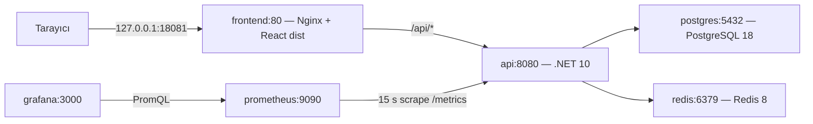

# FullStack Ops Lab

**Full-Stack Docker, Infrastructure & Observability Lab**

[](https://github.com/EnsarAslannn/fullstack-ops-lab/actions/workflows/ci.yml)

Sandbox Tasks, görev oluşturma, listeleme, tamamlama/yeniden açma ve silme üzerinden full-stack geliştirme ve operasyon kavramlarını öğreten bir portföy projesidir. React arayüzü Nginx üzerinden ASP.NET Core API'ye ulaşır; görevler PostgreSQL'de, liste cache'i Redis'te tutulur. Prometheus metrik toplar, Grafana datasource ve Overview dashboard'u dosyalardan otomatik yükler.

Phase 0, Module 1–11 ve yedi troubleshooting senaryosunun kabul kanıtları belgelerde bulunur. **6 Ekim 2026 teknik final kabulü geçti:** remote main SHA92e98a1 aynı host üzerinde temiz clone, boş izole veri ortamı ve gerçek browser ile doğrulandı. [Final kabul raporu](docs/final-acceptance.md) kanıtları ve sınırları içerir; manuel öğrenme değerlendirmesi bekler. Production deployment, unit-test coverage veya hazırlıksız tek komut kurulum iddia edilmez. Otorite [PROJECT_SPEC.md](PROJECT_SPEC.md), ilerleme kaydı [PROJECT_STATUS.md](PROJECT_STATUS.md).

## Mimari ve teknoloji



.NET 10 / EF Core / Npgsql; React / TypeScript / Vite; PostgreSQL, Redis, Nginx; Docker/Compose; OpenTelemetry Metrics, Prometheus, Grafana ve GitHub Actions kullanılır. Gerçek sürüm tag'leri [Compose](compose.yaml), [backend Dockerfile](src/backend/FullStackOpsLab.Api/Dockerfile), [frontend Dockerfile](src/frontend/Dockerfile) ve lock/proje dosyalarındadır.

## Özellikler

- Altı servis, iki multi-stage uygulama image'ı ve ortak `app` bridge ağı.
- PostgreSQL named volume ile kalıcılık; açık EF migration hazırlığı.
- Liste GET'i için cache-aside, varsayılan 60 s TTL ve başarılı mutation sonrası invalidation.
- Loading, empty, error/retry, başlık validation'ı ve işlem sırasında disabled butonlar.
- Ayrı liveness/readiness, güvenli request özetleri ve cache logları.
- Internal metrics, kalıcı Prometheus TSDB, otomatik datasource ve 12 panelli Grafana Overview.
- Build/configuration/secret ve izole Compose runtime CI; yedi teşhis/toparlanma senaryosu.

API: GET liste/tekil kayıt **200**, POST **201 + Location**, PUT **200**, DELETE **204**, boş başlık **400**, bulunmayan ID **404**. JSON: `id`, `title`, nullable `description`, `isCompleted`, `createdAt`, `updatedAt`. Redis kapalıyken liste GET'i hata verebilir; fail-open/circuit breaker yoktur. [Request örnekleri](src/backend/FullStackOpsLab.Api/Tasks.http).

## Ön koşullar

| Araç | Gerektiği akış |
| --- | --- |
| Git | Clone |
| Docker Engine + Compose | Altı servis ve image build |
| PowerShell | Belgelenmiş onboarding/preflight komutları |
| .NET 10 SDK + local dotnet tool restore | İlk migration SQL'ini host üzerinde üretme; backend host build |
| Node.js 24 / npm | Yalnız host frontend geliştirme/build; Docker build kendi Node stage'ini kullanır |

Host API geliştirmesi ayrı user-secrets ve erişilebilir DB/Redis host portları gerektirir. Mevcut Compose bu portları yayınlamaz; yalnız stack'i açmak host API bağlantısını hazırlamaz.

## İlk kurulum

```powershell
git clone https://github.com/EnsarAslannn/fullstack-ops-lab.git
Set-Location fullstack-ops-lab
```

[Kurulum rehberinin 13. bölümünü](labs/09-environment-configuration/README.md#13-temiz-bilgisayar-kurulum-rehberi) sırayla izle:

1. Engine/Compose ve host EF araçlarını doğrula.
2. Mevcut dosyayı ezmeden `.env.example` → ignored `.env` hazırla; PostgreSQL/Grafana placeholder'larını yerel editörde doldur.
3. `fullstack-ops-postgres-data` external volume'unu incele; yalnız gerçekten yoksa oluştur. Mevcut volume'u sıfırlama.
4. Env preflight ve repository secret kontrolünü çalıştır.
5. Yalnız PostgreSQL'i başlat; readiness ve TCP credential eşleşmesini doğrula.
6. Mevcut InitialCreate migration'ından idempotent SQL üret, **önce incele**, doğru DB'ye `psql ON_ERROR_STOP` ile uygula; tasks/history'yi doğrula.
7. Altı servisi build edip healthy durumunu kontrol et.

Compose user-secrets'ı otomatik okumaz. Initialized PostgreSQL/Grafana volume'unda env parolasını değiştirmek mevcut kullanıcı parolasını değiştirmez. Gerçek değerleri Git'e/terminale yazma. **Compose up external volume hazırlığının veya migration uygulamasının yerine geçmez.**

## Normal başlatma — hazırlık tamamlandıktan sonra

Repository kökünde PowerShell:

```powershell
powershell -NoProfile -ExecutionPolicy Bypass -File scripts/Module9.EnvPreflight.ps1
if ($LASTEXITCODE -ne 0) { throw 'Preflight başarısız; başlatma.' }
docker compose --env-file .env config -q
if ($LASTEXITCODE -ne 0) { throw 'Compose config başarısız.' }
docker compose --env-file .env up --build -d --wait --wait-timeout 180
if ($LASTEXITCODE -ne 0) { throw 'Altı servis healthy olmadı; teşhis et.' }
docker compose --env-file .env ps
```

| Kullanım | Yerel adres |
| --- | --- |
| Görev arayüzü / API | http://127.0.0.1:18081/ / http://127.0.0.1:18081/api/tasks |
| Prometheus | http://127.0.0.1:9090/ — target job fullstack-ops-api |
| Grafana | http://127.0.0.1:3000/ — yerel admin; FullStack Ops Lab / Overview |

Yalnız bu üç port, yalnız localhost'a yayınlanır. API8080, PostgreSQL5432, Redis6379 Compose ağı içindedir. Health/OpenAPI/metrics Nginx'ten API'ye yönlendirilmez; frontend URL'sindeki SPA HTML, API health kanıtı değildir. OpenAPI yalnız Development'ta internal `/openapi/v1.json`; Swagger UI yoktur.

## Güvenli kapatma

```powershell
docker compose --env-file .env stop  # Container'lar kalır; start ile devam edilebilir.
# Alternatif: container ve proje ağını kaldır, volume'ları koru.
docker compose --env-file .env down
```

`down -v` normal kapatma değildir: Compose-managed Prometheus/Grafana verilerini silebilir. External PostgreSQL volume'u Compose tarafından silinmez; volume silme/prune rutin cleanup değildir. [Komut rehberi](docs/commands-cheatsheet.md).

## Repository ve belgeler

```text
src/backend/FullStackOpsLab.Api/  API, migrations, Dockerfile
src/frontend/                  React, API client, Dockerfile, nginx.conf
monitoring/                    Prometheus/Grafana config ve provisioning
scripts/                       Configuration/preflight/secret kontrolleri
tests/                         Smoke ve runtime kabul scriptleri
labs/                          Module 1–11 kanıtları
troubleshooting/               Yedi hata/çözüm senaryosu
docs/                          Mimari, sözlük ve komut rehberi
.github/workflows/ci.yml        Üç job'lı CI
```

- [Mimari, kısa sözlük, DoD incelemesi ve kabul edilen final kapsamı](docs/architecture.md)
- [Komutlar ve beklenen gözlemler](docs/commands-cheatsheet.md)
- [Teknik final kabul, cleanup ve kalan öğrenme maddeleri](docs/final-acceptance.md)

| Lab | Belge |
| --- | --- |
| 1 — Docker Fundamentals | [Image/container lifecycle](labs/01-docker-fundamentals/README.md) |
| 2 — Dockerfiles | [Baseline ve multi-stage](labs/02-dockerfiles/README.md) |
| 3 — PostgreSQL | [Volume, migration, persistence](labs/03-postgresql/README.md) |
| 4 — Networking | [DNS, localhost ve teşhis](labs/04-docker-networking/README.md) |
| 5 — Redis | [Cache, TTL ve invalidation](labs/05-redis/README.md) |
| 6 — Nginx | [Reverse proxy](labs/06-nginx/README.md) |
| 7 — Compose | [Tarihsel dört servis kabulü](labs/07-docker-compose/README.md) |
| 8 — Health | [Liveness/readiness](labs/08-health-checks/README.md) |
| 9 — Configuration | [Secret, preflight ve bootstrap](labs/09-environment-configuration/README.md) |
| 10 — Observability | [Metrics, Prometheus, Grafana](labs/10-prometheus-grafana/README.md) |
| 11 — CI | [Workflow ve hosted kanıtlar](labs/11-github-actions/README.md) |

| Troubleshooting — şartname sırası | Belge |
| --- | --- |
| 1 — Wrong Localhost | [Senaryo](troubleshooting/01-wrong-localhost/README.md) |
| 2 — Lost PostgreSQL Data | [Senaryo](troubleshooting/02-lost-database/README.md) |
| 3 — Redis Connection Failure | [Senaryo](troubleshooting/03-redis-connection/README.md) |
| 4 — Nginx 502 | [Senaryo](troubleshooting/04-nginx-502/README.md) |
| 5 — Database Not Ready | [Senaryo](troubleshooting/05-database-not-ready/README.md) |
| 6 — Environment Misconfiguration | [Senaryo](troubleshooting/06-env-misconfiguration/README.md) |
| 7 — Prometheus Target Down / Grafana No Data | [Senaryo](troubleshooting/07-monitoring-no-data/README.md) |

## CI ve görseller

[Workflow](.github/workflows/ci.yml) push/pull_request için Linux build/config, Windows configuration/secret ve Linux izole Compose runtime job'larını çalıştırır. Runtime kendi credential/volume/migration ortamını hazırlar ve temizler. Unit-test coverage, image publish veya CD yapmaz. Fork/main-target PR gibi denenmemiş sınırlar Module11 belgesindedir.

[Test edilen SHA'nın başarılı run'ı 37436957155](https://github.com/EnsarAslannn/fullstack-ops-lab/actions/runs/37436957155), commit `92e98a10d072c4e53dc6223c1cde8c490cfd586d`, üç job success. Final demo ayrıca aynı SHA üzerinde yerel izole kabul yaptı; rapor sonrasında yalnız dokümantasyon değişti. Hosted run, temiz VM veya production kabulü değildir.

Görseller: [Prometheus Targets](labs/10-prometheus-grafana/images/prometheus-targets.png), [metric sorgusu](labs/10-prometheus-grafana/images/prometheus-query.png), [Overview](labs/10-prometheus-grafana/images/grafana-overview.png), [yanlış target/recovery](troubleshooting/07-monitoring-no-data/README.md#verification). Kısa tarihsel trafik benchmark değildir.

## Öğrenme çıktıları ve açık final kapsamı

Image/container ayrımını açıklayabilir; DNS → TCP → readiness → SQL/API sırasıyla teşhis yapabilir; volume kalıcılığını, cache hit/miss/TTL/invalidation ve up/readiness farkını kanıtlarla gösterebilirsin. CI build başarısıyla gerçek runtime kabulünün farkını öğrenirsin.

**6 Ekim 2026 kabul edilen kapsam:** Altı servis korunur; Nginx frontend container'ında statik sunucu/reverse proxy, `api` backend rolüdür. Ayrı nginx servisi eklenmez. İlk kurulum `.env`, external PostgreSQL volume'u ve açık migration hazırlığı içerir; hazırlanmış ortam `docker compose up` ile başlar. **Sıfır hazırlıkla tek komut clean clone iddiası yoktur.** [Şartname karar kaydı](PROJECT_SPEC.md#final-kapsam-kararları--6-ekim-2026), [mimari kararları](docs/architecture.md#şartname-farkları-ve-final-kabul-kararları) ve [gerçek final kabul kanıtı](docs/final-acceptance.md) ayrı kayıtlardır. Teknik PASS, senin öğrenme değerlendirmene otomatik PASS vermez.
