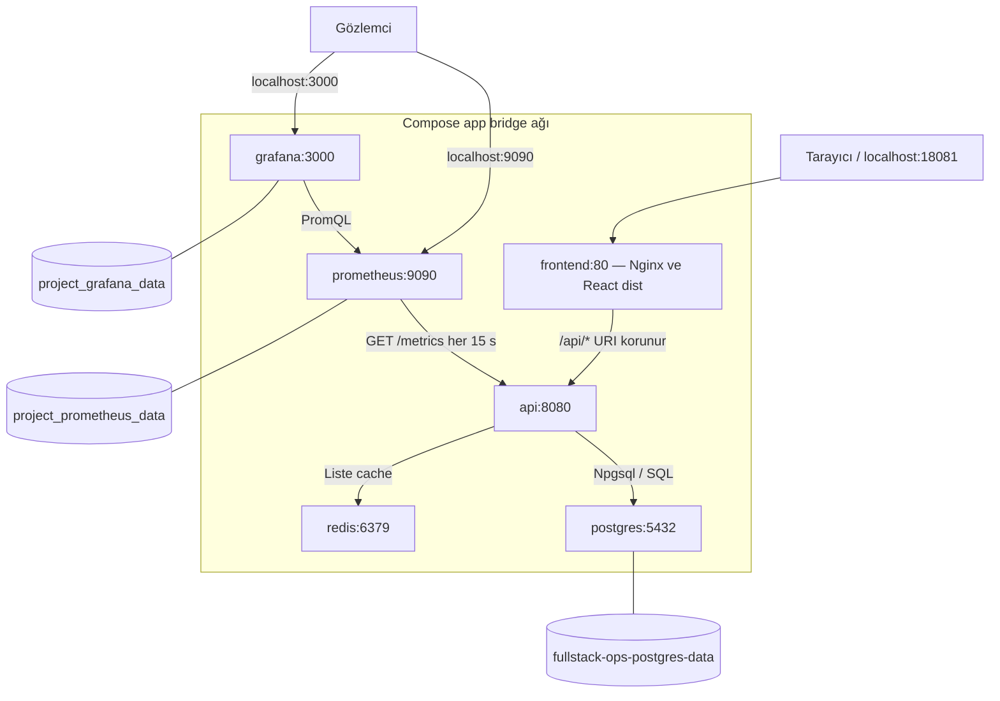
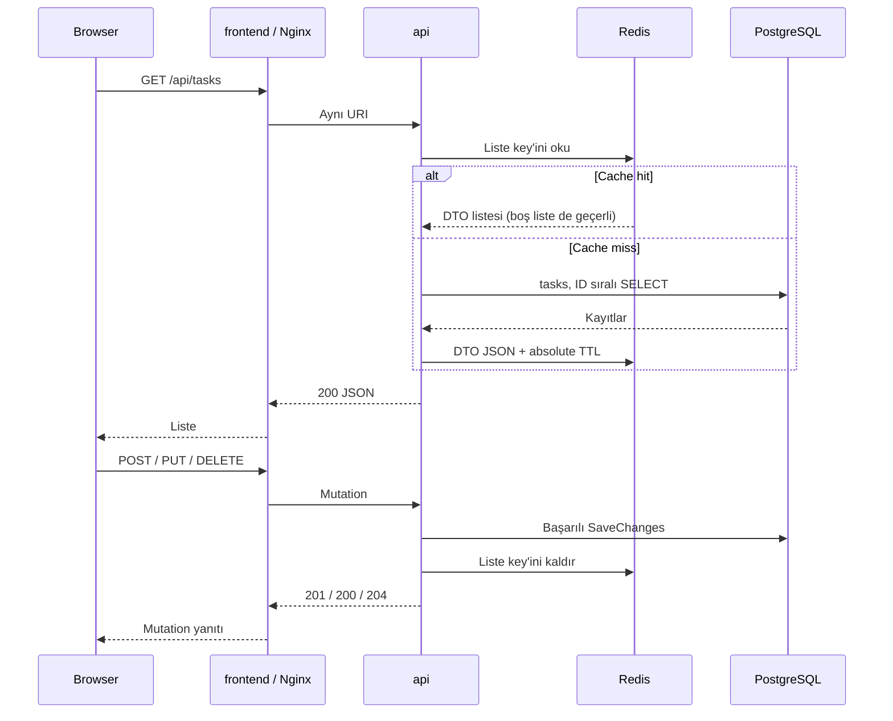

# FullStack Ops Lab — Gerçek Mimari

6 Ekim 2026 kaynak/dokümantasyon incelemesi; yeni runtime kabulü değildir. [Şartname](../PROJECT_SPEC.md), [Compose](../compose.yaml) ve tarihli lab kanıtları birlikte okunmalıdır.

## Servisler, portlar ve ağ

| Servis | Sorumluluk | Container portu | Host yayını | Probe |
| --- | --- | --- | --- | --- |
| frontend | React dist + Nginx static/reverse proxy | 80 | 127.0.0.1:18081 | wget `/` |
| api | .NET10 Task API, EF/Npgsql, Redis, metrics | 8080 | Yok | Bash TCP `/health/ready` |
| postgres | PostgreSQL18 Alpine, ana veri | 5432 | Yok | pg_isready |
| redis | Redis8.2.10 Alpine, geçici cache | 6379 | Yok | redis-cli ping |
| prometheus | v3.13.4 internal scrape + TSDB | 9090 | 127.0.0.1:9090 | wget `/-/ready` |
| grafana | 13.2.3 datasource/dashboard | 3000 | 127.0.0.1:3000 | wget `/api/health` |

Altısı tek `app` user-defined bridge ağına bağlanır. Ağ adı proje prefix'iyle oluşur (normal clone klasöründe `fullstack-ops-lab_app`). `internal: true`, sabit IP, `container_name` veya ikinci ağ yoktur. Host portlarının kapalı olması aynı ağdaki servislerin erişimini engellemez; bu ağ production güvenlik sınırı değildir.

Kaynaklar: [Nginx](../src/frontend/nginx.conf), [Program.cs](../src/backend/FullStackOpsLab.Api/Program.cs), [Prometheus](../monitoring/prometheus/prometheus.yml), [datasource](../monitoring/grafana/provisioning/datasources/prometheus.yml), [provider](../monitoring/grafana/provisioning/dashboards/overview.yml), [dashboard JSON](../monitoring/grafana/dashboards/overview.json).

## Build ve runtime

- API SDK build stage restore/publish yapar; final `aspnet:10.0-noble` yalnız publish çıktısını taşır. SDK/source/EF CLI yoktur.
- Frontend Node24 build stage npm ci/Vite build yapar; final Nginx stage dist ve nginx.conf taşır. Node/npm/source/node_modules yoktur.
- Context'lerin `.dockerignore` kuralları env ve local build çıktılarını dışlar. Runtime credential'ları Dockerfile ARG/ENV ile image'a bake edilmez.
- Host araçları ayrı gereksinimdir: ilk SQL üretimi .NET10 SDK ve kökteki [dotnet-tools.json](../dotnet-tools.json) ile EF10.0.12 ister. Host Node/npm yalnız host frontend akışı için gerekir.

## Request ve cache akışı

Browser API client `/api/tasks` relative path kullanır. Nginx `location /api/`, `proxy_pass http://api:8080;` ile URI'yi korur; `/` statik dosya/SPA fallback sunar. Host Vite development proxy'si ayrı olarak `127.0.0.1:5162` hedefini kullanır; production image'da Vite server yoktur.

Key `fullstack-ops:tasks:all:v1`, varsayılan absolute TTL60s, override `Cache__TasksTtlSeconds`. Tekil GET doğrudan DB okur. Validation400/missing404 invalidation yapmaz. Başarılı DB yazmasından sonra invalidation hatası başarı yanıtını bozmaz; uyarı ve TTL sonuna kadar stale cache riski vardır. Redis'e erişilemeyen liste GET'i hata verir; fallback yoktur. Eşzamanlı miss/yazma yarışı için koordinasyon garantisi verilmez.

## Veri ve provisioning kalıcılığı

| Kaynak | Mount / sahiplik | Lifecycle |
| --- | --- | --- |
| PostgreSQL | postgres-data → external fullstack-ops-postgres-data, `/var/lib/postgresql` | Aynı volume yeniden bağlanırsa veri korunur; Compose yaratmaz/silmez |
| Redis | `/data` tmpfs; snapshot/AOF kapalı | Cache restart/recreate'de kaybolabilir; DB'den yeniden üretilir |
| Prometheus | Compose-managed prometheus_data → `/prometheus` | Normal down korur; retention7d veya 256MB, önce sınırına ulaşan uygulanır; kesin/anlık toplam disk quota garantisi değil |
| Grafana | Compose-managed grafana_data → `/var/lib/grafana` | Kullanıcı/state korunur; tanımlar ayrı read-only mount'lardan gelir |

Prometheus/Grafana `mem_limit:512m`, `cpus:1.0`. Datasource UID `fullstack-ops-prometheus`, Overview UID `fullstack-ops-overview`. Provider/datasource/JSON read-only mount edilir. Volume history/state, provisioning tanım saklar; aynı işlem değiller. Yeni volume initialization'ında admin/POSTGRES_* değerleri etkilidir; initialized PG/Grafana kullanıcı parolası env değişikliğiyle rotate olmaz.

## Configuration ve ilk hazırlık

Compose .env ile YAML substitution yapar; yalnız service environment alanları process'e aktarılır. API hedefleri postgres5432 ve redis6379; host API user-secrets otomatik taşınmaz. `ConnectionStrings__Postgres`, .NET'te `ConnectionStrings:Postgres` olur. Statik parser/preflight doğru hostname, parola veya readiness kanıtlamaz.

İlk hazırlık: ignored env → external volume sahiplik kontrolü → preflight → yalnız postgres readiness/TCP auth → mevcut InitialCreate SQL üretimi/inceleme/uygulama → tasks/history kontrolü → altı servis. API startup otomatik migration yapmaz. [Doğru PowerShell/UTF-8/psql komutları](../labs/09-environment-configuration/README.md#13-temiz-bilgisayar-kurulum-rehberi) otoritedir; SQL örneği burada çoğaltılmadı.

## Health, log ve observability

| Sinyal | Gösterdiği | Kanıtlamadığı |
| --- | --- | --- |
| /health, /health/live | API self check200 | DB/Redis hazırlığı |
| /health/ready | PostgreSQL SELECT1 ve Redis okuma; 200/503 | Migration/table/CRUD doğruluğu |
| Docker API health | Readiness probe; gecikmeli healthy/unhealthy | Proses otomatik restart edilecek |
| Prometheus up | /metrics scrape başarısı | Readiness/datasource/tüm sistem sağlığı |
| Grafana datasource health | Prometheus query API bağlantısı | Target'lar UP veya sorgu dolu |

API başlangıçta postgres/redis service_healthy, frontend API health bekler. Sonraki kesintiler depends_on ile otomatik düzeltilmez. Prometheus/Grafana kendi sağlıklarını denetler; API ready olmasa da scrape başarılı kalabilir. Health/OpenAPI/metrics Nginx'te proxy edilmez; SPA200 bu endpoint'lerin başarı kanıtı değildir.

ILogger method, güvenli route template/unmatched, final status ve süre kaydeder; body/query/Authorization/Cookie kaydetmez. Health/metrics hem request summary hem HTTP metric dışında tutulur. Cache hit/miss/invalidation log ve counter'ları vardır. Loglar container stdout/stderr'dedir; merkezi log deposu, distributed tracing veya servisler arası correlation akışı uygulanmadı.

12 panel: up, HTTP rate, 5xx%, histogram p95, process CPU/working set, hit/miss rate, hit%, invalidation rate, üç cache toplamı. Counter rate resetlere göre yorumlanır; toplamlar process ömrüne aittir. 15s scrape/refresh, 2m rate penceresi; trafiksiz NaN/boş değer sahte sıfıra çevrilmez. Thread-pool runtime sınırlaması, histogram bucket yaklaşımı ve kısa deneyler performans garantisi vermez. [Gerçek PromQL/birim tablosu](../labs/10-prometheus-grafana/README.md#panel-promql-birim-ve-anlam).

## CI

[ci.yml](../.github/workflows/ci.yml): push/pull_request, contents:read, full action SHA'ları, npm download cache. Ubuntu build/config ve izole altı servis runtime; Windows configuration/secret fixtures. Runtime unique project/credential/volume ve explicit migration kullanır; timeout/exit gate/always cleanup vardır. Development env/DB'ye dayanmaz. Unit-test coverage, image publish, CD, gerçek fork/main-target PR veya runner-loss cleanup garantisi yoktur. [Hosted kanıtlar](../labs/11-github-actions/README.md#kanıtlar-ve-commit-eşleştirmesi).

## Şartname farkları ve final kabul kararları

| Konu | Kanıt / gerçek durum | Kabul kararı |
| --- | --- | --- |
| Backend adı | Backend rolü mevcut api; Nginx/metrics/CI gerçek DNS adını kullanır | 6 Ekim 2026 açık kabulüyle şartnamedeki final servis adı api; sessiz rename yapılmadı |
| Ayrı nginx | Önce Module7 en az yedi servis sayıyordu; mevcut frontend Nginx+dist ile iki rolü bir container'da yapar | **Kabul edildi:** altı servis korunur, ayrı nginx eklenmez. Kullanıcı kararı şartname bölüm8/Module7/30/37'ye işlendi; mimari değiştirilmedi |
| Migration | Bölüm19 manuel/startup/ayrı container seçeneklerini açıklar; burada manuel SQL | Manuel yöntem izin verilen seçenek; startup migration eklemek gerekmez |
| Hazırlıksız ilk up | External volume, uyumlu credentials ve schema hazırlanmalı; Module9 explicit bootstrap kanıtı var | **Kabul edildi:** ilk kurulum .env/external volume/açık migration hazırlığı içerir; normal up hazırlanmış ortamı başlatır. Bölüm31 demosu bu hazırlığı da doğrulamalı; güncel final demo henüz yapılmadı |
| Klasör/sözlük | monitoring/scripts/mevcut lab adları ayrımı korur; kısa sözlük aşağıda | Bölüm9 sadeleştirme izni uygulanır. Glossary örnek ağaçta, bağımsız final checklist maddesi değil; ayrı kopya üretilmedi |

İki kapsam farkı kullanıcı tarafından **6 Ekim 2026** tarihinde kabul edildi; önceki beklenti, kabul edilen tasarım ve gerekçe [şartname karar kaydında](../PROJECT_SPEC.md#final-kapsam-kararları--6-ekim-2026) bulunur. Şartname tutarlı biçimde güncellendi; uygulama ve Compose mimarisi korunur. Kapsam kararı runtime kanıtı değildir: güncel temiz clone/ilk kurulum/final demo ve genel kabul matrisi hâlâ bekler.

## Dokümantasyon standardı ve Definition of Done

Lab tarihli komut/ölçüm/hata/cleanup kanıtları korundu. Bölüm12'nin 14 alt başlığı mevcut ayrıntıya bağlanan kısa bölümlerle eşlendi; eksik soru/alıştırmalar tamamlandı. Yedi troubleshooting belgesi bölüm11'in dokuz başlığını ve PASS/NOT VERIFIED ayrımını korur. Bu **dokümantasyon incelemesidir**, yeni runtime kabulü değildir.

| Module | Mevcut çalışma, hata/çözüm, komut/neden ve öğrenme kanıtı |
| --- | --- |
| 1 | [Nginx lifecycle, HTTP/log/inspect/cleanup](../labs/01-docker-fundamentals/README.md) |
| 2 | [Baseline/multi-stage, ölçüm/cache/build/runtime/standalone sınırı](../labs/02-dockerfiles/README.md) |
| 3 | [Volume/migration/persistence/DB outage](../labs/03-postgresql/README.md) |
| 4 | [DNS/TCP/readiness, localhost ve recovery](../labs/04-docker-networking/README.md) |
| 5 | [Önce başarısız cache testi, TTL/invalidation/outage](../labs/05-redis/README.md) |
| 6 | [Static/API routing, 502/504 ve CRUD](../labs/06-nginx/README.md) |
| 7 | [Tarihsel dört servis, açık migration sınırı, down/up](../labs/07-docker-compose/README.md) |
| 8 | [Dependency readiness ve aynı-container recovery](../labs/08-health-checks/README.md) |
| 9 | [Configuration/preflight/secret, bootstrap/production sınırı](../labs/09-environment-configuration/README.md) |
| 10 | [Metrics/plugin/browser/scrape ve hata/recovery](../labs/10-prometheus-grafana/README.md) |
| 11 | [Hosted build/runtime/PR ve failure/cleanup sınırları](../labs/11-github-actions/README.md) |

Soru/alıştırmaların bulunması geliştiricinin cevapladığını kanıtlamaz. Tarihsel commit önerileri o adımın kaydıdır. Denenmemiş backup restore, alternatif network/datasource arızası, production/load testleri zorunlu kabul yapılmış gibi sunulmaz.

## Kısa sözlük

| Kavram | Projedeki anlamı |
| --- | --- |
| Image / container | Çalıştırma paketi / onun çalışan örneği |
| Context / multi-stage | Docker'a sunulan dosyalar / araçları build stage'de bırakma |
| DNS / localhost | app ağındaki service adı / bulunduğun container veya host loopback'i |
| Volume / bind / tmpfs | Docker veri deposu / host dosyası mount / geçici bellek dosya sistemi |
| Migration | Sürümlü tasks şeması; API start'tan ayrı |
| Cache-aside / TTL / invalidation | Miss'te DB / sınırlı yaşam / başarılı yazmadan sonra kopyayı kaldırma |
| Live / ready / healthy / up | Process / dependency / Docker probe / scrape sonucu |
| Log / metric / trace | Olay / sayısal seri / bileşenler boyunca istek izi; trace uygulanmadı |
| Counter / gauge / histogram | Biriken/resetlenen olay / anlık değer / bucket dağılımı ve yaklaşık p95 |
| Provisioning | Repository'den tanım yükleme; history saklama değil |
| CI / CD | Otomatik doğrulama / deploy; bu workflow CI |

## Kalan final kabul

Kapsam kararları kabul edildi. Sonraki açık yetkiyle güncel commit'ten ayrı temiz clone/yeni config/volume üzerinden bölüm31'in ilk kurulum ve normal başlatma demosunu yürüt; development volume'una bağlanma. CRUD/cache/persistence/health/internal metrics/scrape/dashboard, wrong target/recovery ve CI SHA kanıtlarını genel matrise bağla. Bölüm30/37 checklist ve öğrenme sorularını gerçek kanıtlarla kapat. Unit-test/production/fork/backup garantisi ekleme. Bu görev bunları başlatmadı.
